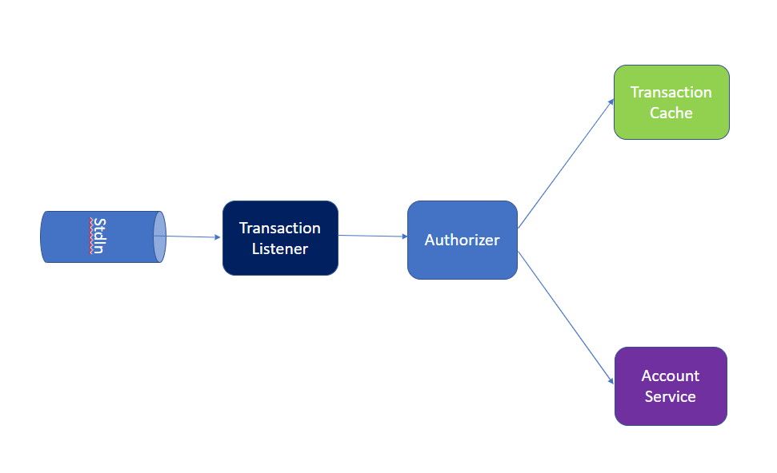
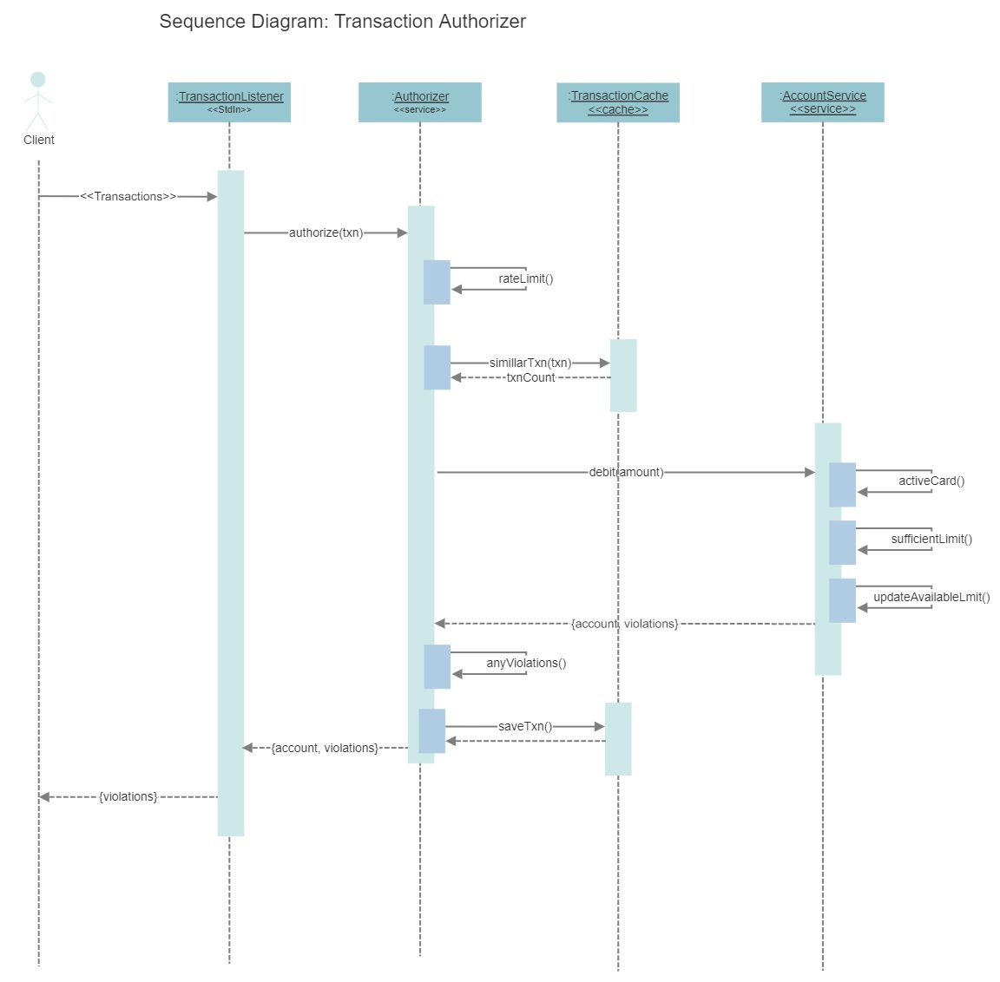
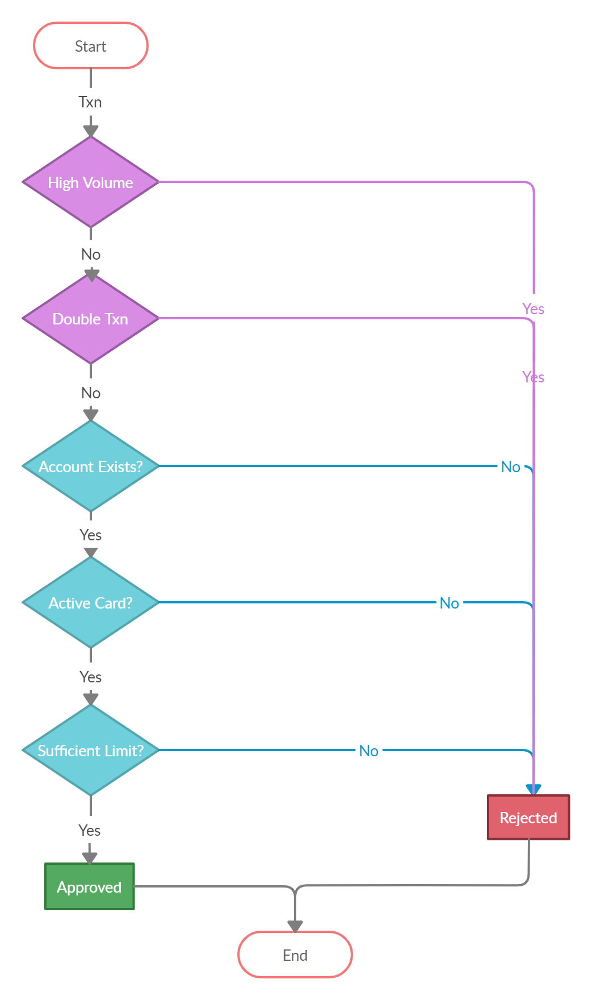

# Transaction Authorizer 

1. [ Purpose. ](#purpose)
2. [ High Level Design. ](#design)
3. [ Design COnsiderations. ](#design)
4. [ Building and deploying the application. ](#build)
5. [ Testing the application. ](#docker)

<a name="purpose"></a>
## 1. Purpose:

The purpose of this application is to read transaction messages coming from standard input and authorizes those transactions if there are no functional and non-functional violations.

<a name="design"></a>
## 2. High Level Design:

#####Authorization High Level Design:



#####Authorization Sequence Diagram:



#####Transaction Authorization Decision Chart:


###2.1. Design Considerations:
* Application timezone will be always 'UTC'
* Authorizer directly calls bank account service for debiting amount for avoiding race conditions instead of calling for available limit first and then call for amount debit.
* Configurable transaction rate limiting 
* Caching recent transactions for detecting double transaction, cache scheduler periodically evicts old transactions, expiration time can be configured.
* Incoming transaction timestamp used for detecting double transaction
* For better performance, transaction cache structure considered as below 
```bash
  Cache Cache<Amount, <Merchant, [Time]>>
```
###2.2. Assumptions:
* Application deals with only once account
* Application resets the state after restart
* Transactions will be provided though standard input
* Transaction timestamp will be used for double transaction detection

<a name="build"></a>
## 3. Building and deploying the application:

<a name="prepreq"></a>
### 3.1. Prerequisites

Install the following software.

* [Oracle Java 8 SDK](https://java.oracle.com)
* [Apache Maven](https://maven.apache.org)
* (Optional) Your favorite IDE, including :
  * [Intellij IDEA](http://www.jetbrains.com)
  * [Eclipse IDE](http://www.eclipse.org)
  
<a name="building"></a>
### 3.2. Building the application:

The project uses [Maven](https://maven.apache.org/) as a build tool. It already contains
`./mvnw` wrapper script, so there's no need to install Maven.

To build the project execute the following command:

#####Note: Please make sure your present working as project root folder  

```bash
  $ chmod 777 ./mvnw
  $ ./mvnw clean package
```
<a name="runningapp"></a>
### 3.3. Running the application:

######Please choose one of the following options

<a name="execjar"></a>
#### 3.1. As a packaged application:
If you use the Spring Boot Maven plugins to create an executable jar you can run your application using java -jar. For example:

```bash
  $ chmod 777 ./mvnw
  $ ./mvnw clean package
  $ java -jar target/authorizer-demo-1.0.0.jar
```
Copy transactions as text and paste them in the application console.

<a name="maven"></a>
#### 3.2. Using the Maven plugin:
```bash
  $ chmod 777 ./mvnw
  $ ./mvnw spring-boot:run
```
Copy transactions as text and paste them in the application console.

<a name="docker"></a>
#### 3.3. Running in a Docker container:

#####3.3.1. Create the image of the application by executing the following command:

```bash
  $ chmod 777 ./mvnw
  $ ./mvnw clean package
  $ docker build -f Dockerfile -t authorizer-demo .
```

#####3.3.2. Prepare the data file for inputting transactions to application.

  Create a file called operations (for example) with below command
```bash
  $ cat > operations.dat
```

Sample data:
```bash
{ "account": { "activeCard": true, "availableLimit": 100 } }
{ "transaction": { "merchant": "Burger King", "amount": 20, "time": "2019-02-13T10:00:00.000Z" } }
{ "transaction": { "merchant": "Habbib's", "amount": 90, "time": "2019-02-13T11:00:00.000Z" } }
```

Awaits input from user, type desired transactions and press CTRL+D to exit. The text will be written in operations file.

You can see content of file with following cat command.
```bash
  $ cat operations.dat
```

#####3.3.3. Run the below command for running the application by providing operations as standard input (StdIn)
```bash
  $ docker run -i --name authorizer-demo authorizer-demo < operations.dat
```

You will see output in the console once programs processes data.

Sample output:
```bash
{ "account": { "activeCard": true, "availableLimit": 100 }, "violations": [] }
{ "account": { "activeCard": true, "availableLimit": 80 }, "violations": [] }
{ "account": { "activeCard": true, "availableLimit": 80 }, "violations": [ "insufficient-limit" ] }
```

Press CTRL + C to exit the program. Container will get stopped since there are no active processes running in it.

#####3.3.4. Run the below command if you want to test again the program, here, we are reusing the container created in previous testing.

Please change the input file name as needed before running the command

```bash
  $ docker start -i authorizer-demo < operations.dat
```
